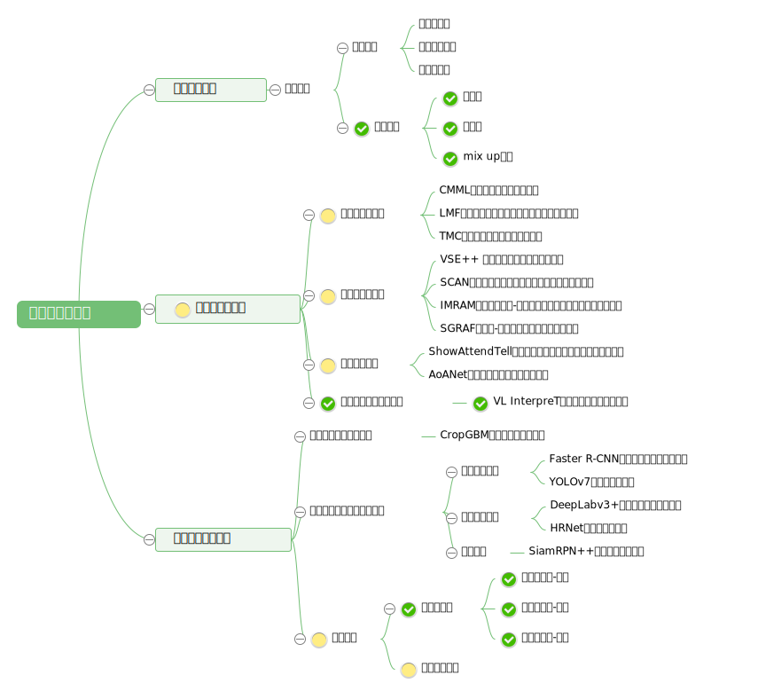

# 欢迎使用育种模型库！

机器学习和深度学习已成为解析农业育种中大规模数据的重要工具，可以帮助我们快速有效地对植物表型和基因型进行分析和挖掘。机器学习可以通过分析大量的基因型和表型数据，识别出对某种性状表现有关的关键基因或基因组区域，并快速筛选出优良品种，从而提高育种效率和产量。此外，通过深度学习的技术，可以将高分辨率遥感图像、田间监测图像和图像传感器采集的图像等多种数据进行处理，进而实现对植物形态、生长状态等特征的自动识别和分类，挖掘其中包含的作物类型、植被指数、土地利用和植物病害等信息。这些应用加速优良品种的选育过程，促进农业的可持续发展。

然而，机器学习的学习门槛较高，需要有一定的编程基础和统计学知识。对于许多农业科研工作者来说，学习和掌握这些技术是一件比较困难的事情。因此，本课题的目标是将现有的机器学习方法进行整合，开发一套针对农业育种的模型库。本课题旨在开发针对农业育种的模型库，提供多种传统/深度学习方法和农业优化算法。同时，提供开放数据集和实验样例以帮助用户。我们希望模型库能推动农业育种的发展，为农业科研工作者带来便利。

本模型库集成了众多模型和应用示例，包含通用机器学习、多模态机器学习和农业育种中的机器学习三个模块。所包含的模型如下图所示：

