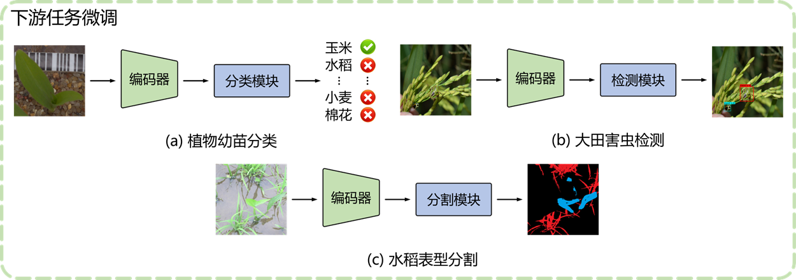

# 基础大模型

## 视觉大模型

我们构建了基于Transformer架构和生成式自监督学习方式的农业视觉基础模型，以更好地迁移预训练获得的农业视觉通用表征，适应不同的下游任务。该模型主要由大量的图像数据和良好的网络架构构成。预训练数据集采用ImageNet大规模的通用自然图像，为自然场景下的农业下游任务学习提供了大量的上游知识。

我们使用Swin Transformer作为农业自然图像的预训练编码器，具有层级式的架构设计、基于窗口的Attention和滑动窗口的多头自注意力等特点，有利于提取不同分辨率的特征、进一步减少计算量和促进信息跨窗交互。

为了微调预训练的Swin Transformer编码器，我们设计了不同的解码模块，包括植物幼苗分类、大田害虫检测以及水稻表型分割三个下游任务。分类数据集包含小麦、玉米、甜菜等12类植物幼苗图像，共计4750张；检测数据集包含水稻大螟、二化螟、稻蝗在内的8类不同时期大田害虫，共计7839张；分割数据集包含水稻秧苗、稻穗、谷粒在内的3类水稻表型图像，共计1754张。

