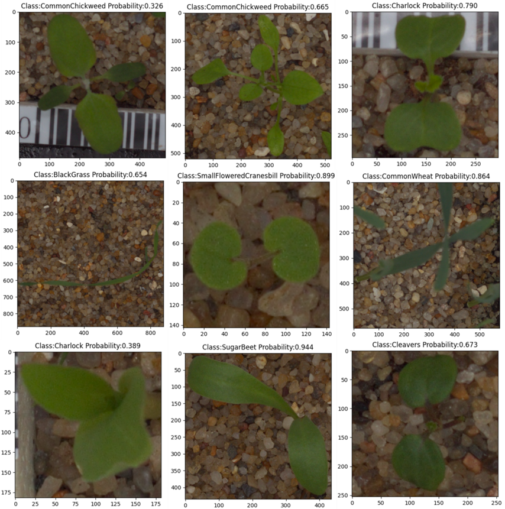

## 视觉大模型--分类
---

## 目录
1. [概述](#概述)
2. [所需环境 Environment](#所需环境)
3. [文件下载 Download](#文件下载)
4. [训练步骤 How2train](#训练步骤)
5. [预测步骤 How2predict](#预测步骤)
6. [评估步骤 How2eval](#评估步骤)
7. [参考资料 Reference](#Reference)

## 概述

这是我们的视觉大模型在幼苗分类任务上的代码。



## 所需环境

pytorch == 1.2.0

## 文件下载
在ImageNet上预训练的权重可以在百度云下载。     
链接: https://pan.baidu.com/s/18Ze7YMvM5GpbTlekYO8bcA     
提取码: 5wym   

在我们的幼苗分类数据集上微调过的权重也可以在百度云下载。   
链接：https://pan.baidu.com/s/1d-7JsdgSF2u72BTqFrvmrg?pwd=g43t 
提取码：g43t

训练所用的VOC格式的幼苗分类迷你数据集也可以在百度云下载。   
链接：https://pan.baidu.com/s/1kuWon5NaDr_iWBT0UP0Olw?pwd=zivn  
提取码：zivn  

## 训练步骤
1. datasets文件夹下存放的图片分为两部分，train里面是训练图片，test里面是测试图片。  
2. 在训练之前需要首先准备好数据集，在train或者test文件里里面创建不同的文件夹，每个文件夹的名称为对应的类别名称，文件夹下面的图片为这个类的图片。文件格式可参考如下：
```
|-datasets
    |-train
        |-SugarBeet
            |-123.png
            |-234.png
        |-Maize
            |-345.png
            |-456.png
        |-...
    |-test
        |-SugarBeet
            |-567.png
            |-678.png
        |-Maize
            |-789.png
            |-890.png
        |-...
```
3. 在准备好数据集后，需要在根目录运行txt_annotation.py生成训练所需的cls_train.txt，运行前需要修改其中的classes，将其修改成自己需要分的类。   
4. 之后修改model_data文件夹下的cls_classes.txt，使其也对应自己需要分的类。  
5. 在train.py里面调整自己要选择的网络和权重后，就可以开始训练了！  

## 预测步骤
### a、使用预训练权重
1. 下载完库后解压，将微调过的模型权重放在model_data下，运行predict.py，输入  
```python
img/blackgrass.png
```
### b、使用自己训练的权重
1. 按照训练步骤训练。  
2. 在classification.py文件里面，在如下部分修改model_path、classes_path、backbone和alpha使其对应训练好的文件；**model_path对应logs文件夹下面的权值文件，classes_path是model_path对应分的类，backbone对应使用的主干特征提取网络，alpha是当使用mobilenet的alpha值**。  
```python
_defaults = {
    #--------------------------------------------------------------------------#
    #   使用自己训练好的模型进行预测一定要修改model_path和classes_path！
    #   model_path指向logs文件夹下的权值文件，classes_path指向model_data下的txt
    #   如果出现shape不匹配，同时要注意训练时的model_path和classes_path参数的修改
    #--------------------------------------------------------------------------#
    "model_path"    : 'model_data/swin_tiny_patch4_window7_224_seedling_classification.pth',
    "classes_path"  : 'model_data/cls_classes.txt',
    #--------------------------------------------------------------------#
    #   输入的图片大小
    #--------------------------------------------------------------------#
    "input_shape"   : [224, 224],
    #--------------------------------------------------------------------#
    #  所用模型种类：
    #  swin_transformer_tiny、swin_transformer_small、swin_transformer_base
    #--------------------------------------------------------------------#
    "backbone"      : 'swin_transformer_tiny',
    #-------------------------------#
    #   是否使用Cuda
    #   没有GPU可以设置成False
    #-------------------------------#
    "cuda"          : True
}
```
3. 运行predict.py，输入  
```python
img/blackgrass.png
```

## 评估步骤
1. datasets文件夹下存放的图片分为两部分，train里面是训练图片，test里面是测试图片，在评估的时候，我们使用的是test文件夹里面的图片。  
2. 在评估之前需要首先准备好数据集，在train或者test文件里里面创建不同的文件夹，每个文件夹的名称为对应的类别名称，文件夹下面的图片为这个类的图片。文件格式可参考如下：
```
|-datasets
    |-train
        |-SugarBeet
            |-123.png
            |-234.png
        |-Maize
            |-345.png
            |-456.png
        |-...
    |-test
        |-SugarBeet
            |-567.png
            |-678.png
        |-Maize
            |-789.png
            |-890.png
        |-...
```
3. 在准备好数据集后，需要在根目录运行txt_annotation.py生成评估所需的cls_test.txt，运行前需要修改其中的classes，将其修改成自己需要分的类。   
4. 之后在classification.py文件里面修改如下部分model_path、classes_path、backbone和alpha使其对应训练好的文件；**model_path对应logs文件夹下面的权值文件，classes_path是model_path对应分的类，backbone对应使用的主干特征提取网络，alpha是当使用mobilenet的alpha值**。  
```python
_defaults = {
    #--------------------------------------------------------------------------#
    #   使用自己训练好的模型进行预测一定要修改model_path和classes_path！
    #   model_path指向logs文件夹下的权值文件，classes_path指向model_data下的txt
    #   如果出现shape不匹配，同时要注意训练时的model_path和classes_path参数的修改
    #--------------------------------------------------------------------------#
    "model_path"    : 'model_data/swin_tiny_patch4_window7_224_seedling_classification.pth',
    "classes_path"  : 'model_data/cls_classes.txt',
    #--------------------------------------------------------------------#
    #   输入的图片大小
    #--------------------------------------------------------------------#
    "input_shape"   : [224, 224],
    #--------------------------------------------------------------------#
    #   所用模型种类：
    #   swin_transformer_tiny、swin_transformer_small、swin_transformer_base
    #--------------------------------------------------------------------#
    "backbone"      : 'swin_transformer_tiny',
    #-------------------------------#
    #   是否使用Cuda
    #   没有GPU可以设置成False
    #-------------------------------#
    "cuda"          : True
}
```
5. 运行eval_top1.py和eval_top5.py来进行模型准确率评估。

## Reference
https://github.com/keras-team/keras-applications   

https://github.com/bubbliiiing/classification-pytorch/tree/main