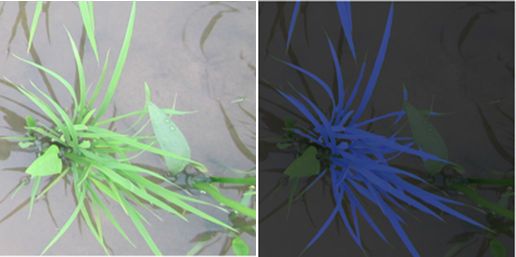

## Hrnet语义分割模型在Pytorch当中的实现
---

HRNet作为图像分割的经典模型，已经在许多领域得到了广泛的应用。然而，对于大部分农业科研工作者来说，模型环境配置和代码运行是一个较为棘手的问题。因此，我们将介绍如何配置模型环境和运行代码，使得农业科研工作者也能够轻松地使用这个模型进行农作物图像的分割任务。我们将使用农作物分割的数据集作为示例，展示该模型在农业领域的应用。



### 目录

1. [所需环境 Environment](#所需环境)
5. [文件下载 Download](#文件下载)
6. [训练步骤 How2train](#训练步骤)
7. [预测步骤 How2predict](#预测步骤)
8. [评估步骤 miou](#评估步骤)
9. [参考资料 Reference](#Reference)


### 所需环境
torch==1.2.0  

### 文件下载
训练所需的权值可在百度网盘中下载。     
链接: https://pan.baidu.com/s/1B7PmhcdScmV5S0SIZE-s_Q     
提取码: 9dss        

我们提供了一个VOC格式的植物分割的数据集示例，下载地址如下： 
链接：https://pan.baidu.com/s/1kuWon5NaDr_iWBT0UP0Olw?pwd=zivn 
提取码：zivn  

### 训练步骤
1、本文使用VOC格式进行训练。  
2、训练前将标签文件放在VOCdevkit文件夹下的VOC2007文件夹下的SegmentationClass中。    
3、训练前将图片文件放在VOCdevkit文件夹下的VOC2007文件夹下的JPEGImages中。    
4、在训练前利用voc_annotation.py文件生成对应的txt。    
5、在train.py文件夹下面，选择自己要使用的主干模型。
6、注意修改train.py的num_classes为分类个数+1。    
7、运行train.py即可开始训练。  

### 预测步骤
#### a、使用预训练权重
1、下载完库后解压，在百度网盘下载权值，放入model_data，修改hrnet.py的backbone和model_path之后再运行predict.py，输入。  
```python
img/street.jpg
```
可完成预测。    
2、在predict.py里面进行设置可以进行fps测试、整个文件夹的测试和video视频检测。       

#### b、使用自己训练的权重
1、按照训练步骤训练。    
2、在hrnet.py文件里面，在如下部分修改model_path、num_classes、backbone使其对应训练好的文件；**model_path对应logs文件夹下面的权值文件，num_classes代表要预测的类的数量加1，backbone是所使用的主干特征提取网络**。    
```python
_defaults = {
    #-------------------------------------------------------------------#
    #   model_path指向logs文件夹下的权值文件
    #   训练好后logs文件夹下存在多个权值文件，选择验证集损失较低的即可。
    #   验证集损失较低不代表miou较高，仅代表该权值在验证集上泛化性能较好。
    #-------------------------------------------------------------------#
    "model_path"        : 'model_data/hrnetv2_w18_weights_voc.pth',
    #----------------------------------------#
    #   所需要区分的类的个数+1
    #----------------------------------------#
    "num_classes"       : 21,
    #----------------------------------------#
    #   所使用的的主干网络：
    #   hrnetv2_w18
    #   hrnetv2_w32
    #   hrnetv2_w48
    #----------------------------------------#
    "backbone"          : "hrnetv2_w18",
    #----------------------------------------#
    #   输入图片的大小
    #----------------------------------------#
    "input_shape"       : [480, 480],
    #-------------------------------------------------#
    #   mix_type参数用于控制检测结果的可视化方式
    #
    #   mix_type = 0的时候代表原图与生成的图进行混合
    #   mix_type = 1的时候代表仅保留生成的图
    #   mix_type = 2的时候代表仅扣去背景，仅保留原图中的目标
    #-------------------------------------------------#
    "mix_type"          : 0,
    #-------------------------------#
    #   是否使用Cuda
    #   没有GPU可以设置成False
    #-------------------------------#
    "cuda"              : True,
}
```
3、运行predict.py，输入    
```python
img/street.jpg
```
可完成预测。    
4、在predict.py里面进行设置可以进行fps测试、整个文件夹的测试和video视频检测。   

### 评估步骤
1、设置get_miou.py里面的num_classes为预测的类的数量加1。  
2、设置get_miou.py里面的name_classes为需要去区分的类别。  
3、运行get_miou.py即可获得miou大小。  

### Reference
https://github.com/ggyyzm/pytorch_segmentation  
https://github.com/bonlime/keras-deeplab-v3-plus
https://github.com/HRNet/HRNet-Semantic-Segmentation
https://github.com/bubbliiiing/hrnet-pytorch