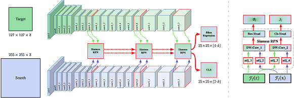

# SiamRPN++_PyTorch 



这是 [SiamRPN++ (CVPR2019)](https://arxiv.org/pdf/1812.11703.pdf)的非官方PyTorch版本, 由 **[Peng Xu](http://www.pengxu.net)** 和 **[Jin Feng](https://github.com/JinDouer)** 实现。可以在多个GPU中运行，并使用LMDB加速数据读

本项目可以在ILSVRC2015_VID数据集上训练。


## 环境配置

```
# 1. 安装cv2包
conda install opencv

# 2. 安装lmdb包
conda install lmdb

# 3. 安装fire包
pip install fire -c conda-forge
```

## 训练步骤

```
# 1. 将我们的项目拷贝到本地


# 2. 进入SiamRPN_plus_plus_PyTorch文件夹
cd SiamRPN_plus_plus_PyTorch

# 3. 下载训练数据。在这个项目中，我们提供了ILSVRC2015_VID数据集的下载和预处理脚本。请下载ILSVRC2015_VID数据集（86GB）。
cd data
wget -c http://bvisionweb1.cs.unc.edu/ilsvrc2015/ILSVRC2015_VID.tar.gz
tar -xvf ILSVRC2015_VID.tar.gz
rm ILSVRC2015_VID.tar.gz
cd ..

# 4. 数据预处理
chmod u+x ./preprocessing/create_dataset.sh
./preprocessing/create_dataset.sh

# 5. 将经过预处理的数据打包为LMDB格式，以加速数据加载。
chmod u+x ./preprocessing/create_lmdb.sh
./preprocessing/create_lmdb.sh

# 6. 开始训练
chmod u+x ./train.sh
./train.sh
```

## 参考资料

https://github.com/PengBoXiangShang/SiamRPN_plus_plus_PyTorch#requirements
