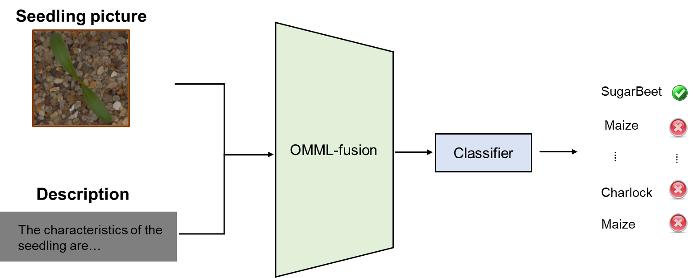

# AoANet：用于图像描述的注意力机制

## 简介

AoANet提出了一个“Attention on Attention”(AoA)模块，该模块扩展了常规的注意力机制，以确定注意力结果和查询结果的相关性。AoA首先使用注意力结果和当前的上下文生成一个“信息向量”和一个“注意力门”，然后通过对它们进行逐元素乘法来增加另外一个注意力，最终获得“关注信息”，即预期的有用知识。将AoA应用于描述模型的编码器和解码器中，将其命名为AoANet。实验表明，AoANet的性能优于以前发布的所有方法。
在我们的 [OMML](https://github.com/njustkmg/OMML) 多模态学习工具包中，提供了AoANet模型。OMML主要基于PyTorch，兼容Paddle版本，旨在提供模态联合学习和跨模态学习算法模型库，为处理图像和文本等多模态数据提供高效的解决方案，促进多模态机器学习的应用。该工具包具有如下功能：

- 多任务场景：OMML提供多种多模态学习任务算法模型库，如多模态融合、跨模态检索、图像字幕，并支持用户自定义数据和训练。
- 应用案例：基于OMML有相关的实际应用，如运动鞋真伪识别、图像描述、谣言检测等。

## 在农业育种中的应用

多模态学习工具包OMML可以应用于农业育种的多个方面，包括但不限于以下几个方面：

1. 图像识别和分析：多模态学习可以帮助农业科学家识别和分析植物图像，以便进行农作物品种鉴别、生长状态监测和病虫害诊断等任务。例如通过文字描述和图像来对植物幼苗进行分类。
2. 数据融合：多模态学习可以将来自不同传感器的数据进行融合，以提高数据的质量和精度。例如，将图像数据和传感器数据（如温度、湿度、光照等）结合起来，可以更准确地预测植物的生长状况和产量。
3. 遗传分析：多模态学习可以应用于遗传分析领域，帮助科学家理解植物基因组的复杂性和多样性。例如，通过将基因组数据与形态学和表型数据结合起来，可以更好地研究植物基因组的功能和演化。
4. 农作物品种推荐：通过文本-图像检索技术，可以将用户输入的农作物品种信息与拍摄的农作物图片进行匹配，从而推荐出该品种的最佳种植条件和生长管理方法。这对于农民和种植者来说非常有用，因为他们可以根据推荐结果来优化农作物生产效率和产量。
5. 农作物病虫害预警：通过文本-图像检索技术，可以将已知的植物病虫害信息与用户输入的相关文本进行匹配，并通过检索拍摄的植物图片，及早预警可能出现的病虫害问题。这有助于农民和种植者及时采取预防和治疗措施，保障农作物生长和产量。
6. 图像描述生成：图像描述生成是指根据给定的图像生成相应的自然语言描述。在农业育种中，图像描述生成可以用来描述农作物的生长情况、病虫害情况等。通过分析这些描述，可以帮助农业从业者更好地了解农作物的生长状况。

以下是通过多模态学习对植物幼苗分类的一个示例：



在此示例中，我们将幼苗图像与描述输入到OMML中进行模态融合、分类，来判断输入的图像是什么植物的幼苗。我们并没有为此示例准备数据集，如果您希望训练自己的数据集，可以参考我们的[数据集构建说明](https://github.com/njustkmg/OMML/blob/Pytorch/data/README.md)进行数据集构建，并参考 [使用](#使用) 部分的示例来进行训练。


## 使用

下载工具包

```
git clone https://github.com/njustkmg/OMML.git
```

### 在 OMML 中使用 AoANet:

#### Torch 示例:

```python
from torchmm import TorchMM

# config: Model running parameters, see configs/
# data_root: Path to dataset
# image_root: Path to images
# cuda: Which gpu to use

runner = TorchMM(config='configs/aoanet_xe.yml',
                 data_root='data/COCO', 
                 image_root='data/COCO/images',
                 out_root='experiment/aoanet_torch',
                 cuda=0)

runner.train()
runner.test()
```

或

```
python run_torch.py --config configs/aoanet_xe.yml --data_root data/COCO --image_root data/COCO/images --out_root experiment/aoanet_torch --cuda 0
```

#### Paddle 示例:

```python
from paddlemm import PaddleMM

# config: Model running parameters, see configs/
# data_root: Path to dataset
# image_root: Path to images
# gpu: Which gpu to use

runner = PaddleMM(config='configs/aoanet_xe.yml',
                  data_root='data/COCO', 
                  image_root='data/COCO/images', 
                  out_root='experiment/aoanet_paddle',
                  gpu=0)

runner.train()
runner.test()
```

或

```
python run.py --config configs/aoanet_xe.yml --data_root data/COCO --image_root data/COCO/images --out_root experiment/aoanet_paddle --gpu 0
```

