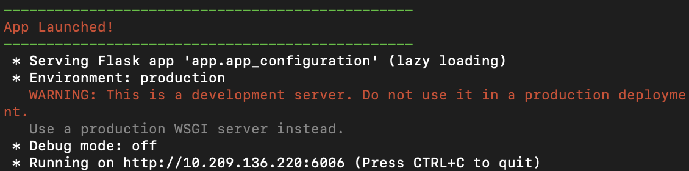
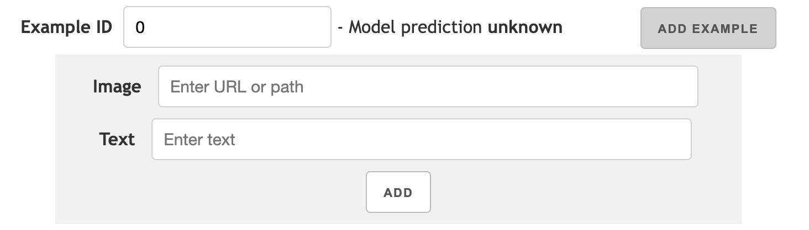

# 概要

VL InterpreT是一个交互式的可视化工具，用于解释视觉语言transformer中的注意力和数据表征。它是一个集成的通用工具，具有以下功能：

- 在多层transformer模型中，跟踪视觉和语言组件中各层中各个注意力头的数据。

- 通过可视化技术，将模型的关注力热力图呈现出来，以展示不同层次的注意力在跨模态和内部模态之间的变化。

- 绘制视觉和语言令牌在经过变压器层时的隐藏表示。

  

  <p align="center">
    
  </p>


# 设置和使用
您可以将VL InterpreT与您自己的模型一起运行（请参阅 [建立实时模型](#建立实时模型)），和/或包含模型提取数据的数据库一起运行。

要使用示例数据库运行VL InterpreT，请首先克隆我们的模型库，进入该文件夹，并安装依赖项。例如：

```bash
git clone 
cd VL-InterpreT
# 如果需要，创建并激活虚拟环境，然后：
pip install -r requirements.txt
```

然后您可以运行VL InterpreT（可以将6006替换为您喜欢的任何端口号）：
```bash
python run_app.py --port 6006 --database example_database2
# 或者：
python run_app.py -p 6006 -d example_database2
```

我们在这个存储库中包含了两个示例数据库`example_database1`包含灰色图像和随机生成的数据，而`example_dataase2`包含由KD-VLP模型处理的一个示例图像+文本对。

一旦应用程序运行，它将显示应用程序运行的IP地址。在浏览器中打开它以使用VL InterpreT：

<p align="center">
  
</p>


## 建立数据库
您可以从transformer中提取特定格式的数据，然后使用VL InterpreT以交互方式将其可视化。要建立一个这样的数据库，可以参阅`db_example.py`，这是一个使用随机生成的数据（即`example_database1`）创建数据库的示例脚本。要准备来自您自己的transformer的数据，对于每个图像+文本对，需要：

- 从transformer中提取交叉注意力权重和隐藏层中的表示向量
  - 例如，您可以从 [Huggingface的模型]((https://huggingface.co/transformers/v3.0.2/model_doc/bert.html#transformers.BertModel.forward)) 中指定`output_antions=True`和`output_hidden_states=True`，来提取它们。
- 将原始输入图像作为数组，并将输入令牌作为字符串列表（文本令牌后面跟着图像令牌，其中图像令牌可以根据您的意愿命名，例如“img_0”、“img_1”等）。
- 对于输入图像的令牌，需要指定它们与原始图像中的位置的对应方式，我们规定左上角的坐标为（0，0）。

有关更多详细信息，请参阅`db_example.py`。您也可以查看我们的`example_database1`和已预处理的数据库`example_datebase2`。

按照上述规定准备好数据后，请按以下格式对其进行组织（具体信息请参见`db_example.py`）：

```python
data = [
  {  # first example
    'ex_id': 0,
    'image': np.array([]),
    'tokens': [],
    'txt_len': 0,
    'img_coords': [],
    'attention': np.array([]),
    'hidden_states': np.array([])
  },
  {  # second example
    'ex_id': 1,
    'image': np.array([]),
    'tokens': [],
    'txt_len': 0,
    'img_coords': [],
    'attention': np.array([]),
    'hidden_states': np.array([])
  },
  # ...
]
```
然后在“app/database”目录运行以下代码来创建该数据库并进行预处理：

```python
import pickle
from database import VliLmdb  # 它在 app/database/database.py

# 创建数据库
db = VliLmdb(db_dir='path_to_your_database', read_only=False)
# 添加数据
for ex_data in data:
    db[str(ex_data['ex_id'])] = pickle.dumps(ex_data, protocol=pickle.HIGHEST_PROTOCOL)
# 对数据库进行预处理
db.preprocess()
```
接下来就可以使用VL InterpreT可视化您的数据：:
```bash
python run_app.py -p 6006 -d path_to_your_database
```

## 建立实时模型
您也可以使用transformer模型与VL Interpre T一起运行。接下来，在web应用程序上就可以使用“添加示例”（`Add example`）功能——用户可以添加图像+文本对，以便transformer实时处理它们，并使用VL InterpreT将处理过程进行可视化：

<p align="center">
  
</p>
如果要添加模型，您需要定义自己的模型类，该类要继承自`VL_Model`基类，在该类中还需要实现`data_setup`函数。该函数应在给定输入图像+文本对的情况下对模型进行正向传递，并以所需格式返回数据（例如，注意力权重、隐藏状态向量等）。

要添加模型，您需要定义自己的模型类，该类继承自[VL_model]（）基类，然后在该类中实现“data_setup”函数。该函数应在给定输入图像+文本对后与模型一起进行正向传递，并以所需格式返回数据（例如注意力权重、隐藏层向量等）。返回数据格式与 [建立数据库](#建立数据库) 和`db_example.py`中指定的格式相同。**有关详细信息，请参阅 `vl_model.py`**。您也可以参考 `kdvlp.py`作为一个示例模型的类。

此外，请使用以下脚本和类的命名模式，以确保您的模型可以轻松地运行VL InterpreT：

- 为您的模型类在`app/database/models`中创建一个新的python脚本，并以小写字母命名（例如，`app/database/models/yourmodelname.py`）
- 用首字母大写命名模型类，例如`class Yourmodelname`。这个类名应该是调用`'yourmodelname'.title()`的结果，其中`yourmodelname.py`是python脚本的名称。
- 例如，我们的KD-VLP模型类在`app/database/models/kdblp.py`中定义，并命名为`class Kdvlp`。

一旦您完成以上步骤，那您就可以按照以下方法使用您的模型运行VL InterpreT：

```bash
python run_app.py --port 6006 --database example_database2 --model yourmodelname your_model_parameters
# 或者：
python run_app.py -p 6006 -d example_database2 -m yourmodelname your_model_parameters
```

请注意，模型类的`__init__`方法可以采用任意数量的参数，并且在运行VL InterpreT时，您可以将这些参数放在模型的名称后面并指定这些参数。（如替换`your_model_parameters`）。


# 参考

https://github.com/IntelLabs/VL-InterpreT/tree/main
