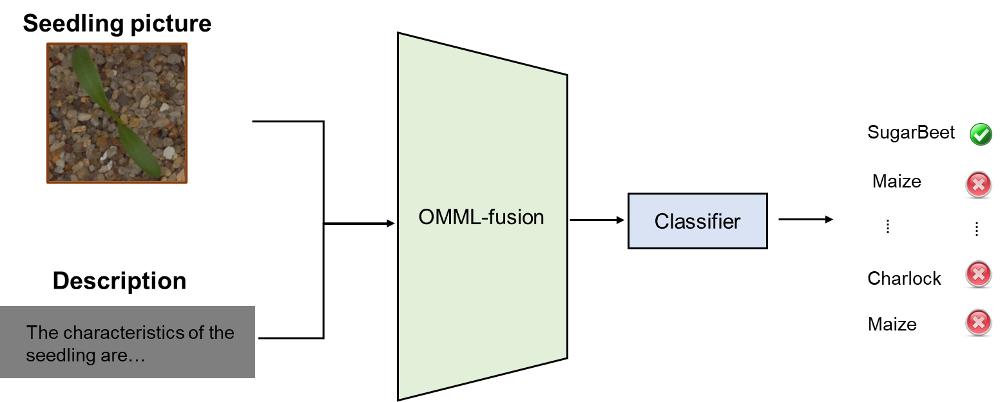

# CMML：综合半监督多模态学习

## 简介

CMML框架是一种全面、灵活、有效的半监督多模态学习方法。该方法可以帮助我们更好地处理现实世界中存在的多模态数据挑战，并在各种应用场景中取得优异表现。该框架通过考虑一个统一框架中的不足性来平衡一致性和差异性模态。具体而言，该模型利用实例级别的注意力机制来加权不同模态上每个实例的充分性。此外，该框架还设计了新颖的多样性正则化和鲁棒一致性度量方法来发现不足的模态。在真实世界数据上的实验中，CMML在各种指标相对于其他方法具有更优异的表现。

在我们的 [OMML](https://github.com/njustkmg/OMML) 多模态学习工具包中，提供了CMML框架。OMML主要基于PyTorch，兼容Paddle版本，旨在提供模态联合学习和跨模态学习算法模型库，为处理图像和文本等多模态数据提供高效的解决方案，促进多模态机器学习的应用。该工具包具有如下功能：

- 多任务场景：OMML提供多种多模态学习任务算法模型库，如多模态融合、跨模态检索、图像字幕，并支持用户自定义数据和训练。
- 应用案例：基于OMML有相关的实际应用，如运动鞋真伪识别、图像描述、谣言检测等。

## 在农业育种中的应用

多模态学习工具包OMML可以应用于农业育种的多个方面，包括但不限于以下几个方面：

1. 图像识别和分析：多模态学习可以帮助农业科学家识别和分析植物图像，以便进行农作物品种鉴别、生长状态监测和病虫害诊断等任务。例如通过文字描述和图像来对植物幼苗进行分类。
2. 数据融合：多模态学习可以将来自不同传感器的数据进行融合，以提高数据的质量和精度。例如，将图像数据和传感器数据（如温度、湿度、光照等）结合起来，可以更准确地预测植物的生长状况和产量。
3. 遗传分析：多模态学习可以应用于遗传分析领域，帮助科学家理解植物基因组的复杂性和多样性。例如，通过将基因组数据与形态学和表型数据结合起来，可以更好地研究植物基因组的功能和演化。
4. 农作物品种推荐：通过文本-图像检索技术，可以将用户输入的农作物品种信息与拍摄的农作物图片进行匹配，从而推荐出该品种的最佳种植条件和生长管理方法。这对于农民和种植者来说非常有用，因为他们可以根据推荐结果来优化农作物生产效率和产量。
5. 农作物病虫害预警：通过文本-图像检索技术，可以将已知的植物病虫害信息与用户输入的相关文本进行匹配，并通过检索拍摄的植物图片，及早预警可能出现的病虫害问题。这有助于农民和种植者及时采取预防和治疗措施，保障农作物生长和产量。

以下是通过多模态学习对植物幼苗分类的一个示例：



在此示例中，我们将幼苗图像与描述输入到OMML中进行模态融合、分类，来判断输入的图像是什么植物的幼苗。我们并没有为此示例准备数据集，如果您希望训练自己的数据集，可以参考我们的[数据集构建说明](https://github.com/njustkmg/OMML/blob/Pytorch/data/README.md)进行数据集构建，并参考 [使用](#使用) 部分的示例来进行训练。


## 使用

下载工具包

```
git clone https://github.com/njustkmg/OMML.git
```

### 在 OMML 使用 CMML:

#### Torch 示例:

```python
from torchmm import TorchMM

# config: Model running parameters, see configs/
# data_root: Path to dataset
# image_root: Path to images
# cuda: Which gpu to use

runner = TorchMM(config='configs/cmml.yml',
                 data_root='data/COCO', 
                 image_root='data/COCO/images',
                 out_root='experiment/cmml_torch',
                 cuda=0)

runner.train()
runner.test()
```

或

```
python run_torch.py --config configs/cmml.yml --data_root data/COCO --image_root data/COCO/images --out_root experiment/cmml_torch --cuda 0
```

#### Paddle 示例:
```python
from paddlemm import PaddleMM

# config: Model running parameters, see configs/
# data_root: Path to dataset
# image_root: Path to images
# gpu: Which gpu to use

runner = PaddleMM(config='configs/cmml.yml',
                  data_root='data/COCO', 
                  image_root='data/COCO/images', 
                  out_root='experiment/cmml_paddle',
                  gpu=0)

runner.train()
runner.test()
```

或

```
python run.py --config configs/cmml.yml --data_root data/COCO --image_root data/COCO/images --out_root experiment/cmml_paddle --gpu 0
```

