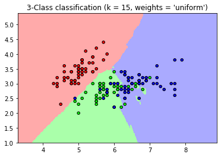
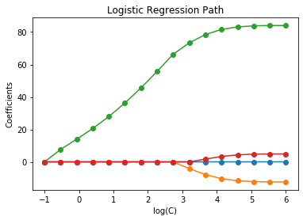
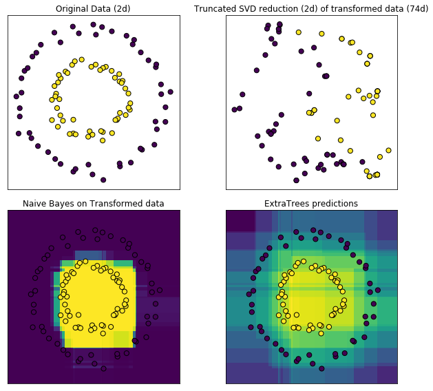
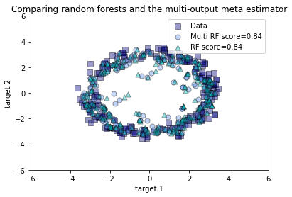
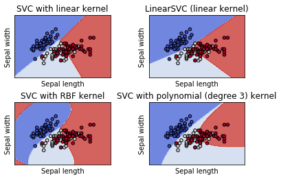

# 目录

以下是本模型库中实现的五种机器学习算法的代码介绍：


1. k Nearest Neighbor（K最近邻算法）)
2. Logistic Regression（逻辑回归）
3. Naive Bayes（朴素贝叶斯算法）
4. Random Forest（随机森林）
5. Support Vector Machine（支持向量机）

# k Nearest Neighbor（K最近邻）


这段代码是一个简单的例子，用于展示如何使用 k-最近邻算法 (k-Nearest Neighbors，KNN) 对鸢尾花数据集进行分类，并绘制分类结果的决策边界。以下是对这段代码的解析：

1. 导入必要的库

```python
import numpy as np
import matplotlib.pyplot as plt
from matplotlib.colors import ListedColormap
from sklearn import neighbors, datasets
```

上述代码中，我们导入了 NumPy 用于数学计算，Matplotlib 用于绘图，以及 scikit-learn 库中的 neighbors 和 datasets 模块。

2. 加载数据

```python
iris = datasets.load_iris()
X = iris.data[:, :2]
y = iris.target
```

这段代码中，我们加载了 scikit-learn 自带的鸢尾花数据集，并将其分成特征矩阵 X 和标签向量 y。特征矩阵 X 包含了鸢尾花的四个特征（萼片长度、萼片宽度、花瓣长度、花瓣宽度），但这里只选择了前两个特征进行可视化。标签向量 y 包含了鸢尾花的三个品种（山鸢尾、变色鸢尾、维吉尼亚鸢尾）。

3. 设置 KNN 参数和绘图参数

```python
n_neighbors = 15
h = .02
cmap_light = ListedColormap(['#FFAAAA', '#AAFFAA', '#AAAAFF'])
cmap_bold = ListedColormap(['#FF0000', '#00FF00', '#0000FF'])
```

这段代码中，我们设置了 KNN 算法的超参数，即最近邻居的个数 n_neighbors，以及绘图时使用的步长 h。此外，我们还创建了两个颜色映射 cmap_light 和 cmap_bold，用于可视化分类结果。

4. 训练和绘制分类器

```python
for weights in ['uniform', 'distance']:
    clf = neighbors.KNeighborsClassifier(n_neighbors, weights=weights)
    clf.fit(X, y)
    x_min, x_max = X[:, 0].min() - 1, X[:, 0].max() + 1
    y_min, y_max = X[:, 1].min() - 1, X[:, 1].max() + 1
    xx, yy = np.meshgrid(np.arange(x_min, x_max, h),
                         np.arange(y_min, y_max, h))
    Z = clf.predict(np.c_[xx.ravel(), yy.ravel()])
    Z = Z.reshape(xx.shape)
    plt.figure()
    plt.pcolormesh(xx, yy, Z, cmap=cmap_light)
    plt.scatter(X[:, 0], X[:, 1], c=y, cmap=cmap_bold,
                edgecolor='k', s=20)
    plt.xlim(xx.min(), xx.max())
    plt.ylim(yy.min(), yy.max())
    plt.title("3-Class classification (k = %i, weights = '%s')"
              % (n_neighbors, weights))
plt.show()
```

这段代码中，我们使用 for 循环分别使用 uniform 和 distance 两种权重方式进行 KNN 分类，并将分类结果绘制出来。

具体地，我们首先创建了一个 KNeighborsClassifier 的实例 clf，然后使用 fit 方法将特征矩阵 X 和标签向量 y 进行拟合。接着，我们创建了一个网格点矩阵 xx 和 yy，用于绘制决策边界。对网格点矩阵中的每个点，我们使用 predict 方法预测其所属的类别，并将结果保存在 Z 中。最后，我们将 Z 重塑为与网格点矩阵 xx 相同的形状，并使用 pcolormesh 方法将分类结果绘制出来。

除了分类结果之外，我们还使用 scatter 方法将原始数据集中的样本点绘制出来，其中不同的类别用不同的颜色表示。最后，我们设置了绘图的横纵坐标范围和标题，并使用 show 方法显示图像。



如果您想将这段代码中使用的数据换成自己的数据，可以将数据集加载和处理的代码替换为适用于您的数据集的代码。具体地，您需要将特征矩阵和标签向量分别存储为 X 和 y，然后将它们传递给 KNeighborsClassifier 的 fit 方法进行拟合。同时，您还需要根据您的数据集修改网格点矩阵的范围和步长，以及颜色映射的颜色值。


# Logistic Regression（逻辑回归）


这段代码实现了一个逻辑回归模型的示例，用于演示在不同的正则化参数下，逻辑回归模型对不同特征的权重（系数）如何变化。下面对代码进行逐行解释：

```python
from time import time
import numpy as np
import matplotlib.pyplot as plt

from sklearn import linear_model
from sklearn import datasets
from sklearn.svm import l1_min_c

# 加载鸢尾花数据集
iris = datasets.load_iris()
X = iris.data
y = iris.target

# 仅使用前两个特征，并将标签为2的样本剔除
X = X[y != 2]
y = y[y != 2]

# 对特征进行归一化（除以最大值），以加快收敛速度
X /= X.max()

# 计算正则化路径
cs = l1_min_c(X, y, loss='log') * np.logspace(0, 7, 16) # 计算正则化参数序列

print("Computing regularization path ...")
start = time()
clf = linear_model.LogisticRegression(penalty='l1', solver='saga',
                                      tol=1e-6, max_iter=int(1e6),
                                      warm_start=True)
coefs_ = []
for c in cs:
    clf.set_params(C=c) # 设置逻辑回归模型的正则化参数
    clf.fit(X, y) # 训练逻辑回归模型
    coefs_.append(clf.coef_.ravel().copy()) # 记录模型的系数
print("This took %0.3fs" % (time() - start))

# 绘制正则化路径图
coefs_ = np.array(coefs_)
plt.plot(np.log10(cs), coefs_, marker='o')
ymin, ymax = plt.ylim()
plt.xlabel('log(C)')
plt.ylabel('Coefficients')
plt.title('Logistic Regression Path')
plt.axis('tight')
plt.show()
```



如果想要将代码中使用的数据换成自己的数据，可以将`X`和`y`分别替换为自己的数据特征矩阵和标签数组。数据特征矩阵`X`的每一列应该代表一个特征，每一行代表一个样本；标签数组`y`应该与数据特征矩阵`X`的行数相同，每个元素代表相应样本的类别标签。另外，如果自己的数据特征矩阵没有进行过归一化，可以考虑使用`sklearn.preprocessing`中的`scale`函数进行归一化处理。

# Naive Bayes（朴素贝叶斯）


这段代码使用了一些机器学习算法来处理并可视化一个人工合成的数据集。以下是代码的详细解释：

```python
import numpy as np
import matplotlib.pyplot as plt
```

导入了numpy和matplotlib.pyplot两个库。

```python
from sklearn.datasets import make_circles
```

从sklearn.datasets中导入了make_circles函数，用于生成一个人工合成的数据集。

```python
from sklearn.ensemble import RandomTreesEmbedding, ExtraTreesClassifier
```

从sklearn.ensemble中导入了RandomTreesEmbedding和ExtraTreesClassifier两个类，用于数据变换和分类。

```python
from sklearn.decomposition import TruncatedSVD
```

从sklearn.decomposition中导入了TruncatedSVD类，用于降维。

```python
from sklearn.naive_bayes import BernoulliNB
```

从sklearn.naive_bayes中导入了BernoulliNB类，用于分类。

```python
X, y = make_circles(factor=0.5, random_state=0, noise=0.05)
```

使用make_circles函数生成一个人工合成的数据集X和标签y。这个数据集由两个圆圈组成，每个圆圈内部都有一些噪声。

```python
hasher = RandomTreesEmbedding(n_estimators=10, random_state=0, max_depth=3)
X_transformed = hasher.fit_transform(X)
```

使用RandomTreesEmbedding将数据集X变换成一个新的数据集X_transformed。这个新的数据集是由10个决策树的输出组成的，每个决策树的深度为3。

```python
svd = TruncatedSVD(n_components=2)
X_reduced = svd.fit_transform(X_transformed)
```

使用TruncatedSVD将X_transformed降维为2维，并将结果存储在X_reduced中。

```python
nb = BernoulliNB()
nb.fit(X_transformed, y)
```

使用BernoulliNB对X_transformed进行分类，将结果存储在nb中。

```python
trees = ExtraTreesClassifier(max_depth=3, n_estimators=10, random_state=0)
trees.fit(X, y)
```

使用ExtraTreesClassifier对X进行分类，将结果存储在trees中。

```python
fig = plt.figure(figsize=(9, 8))
```

创建一个9x8英寸大小的图形。

```python
ax = plt.subplot(221)
ax.scatter(X[:, 0], X[:, 1], c=y, s=50, edgecolor='k')
ax.set_title("Original Data (2d)")
ax.set_xticks(())
ax.set_yticks(())
```

在第1个子图中，使用scatter函数将原始数据集X可视化。每个点的颜色表示它所属的类别，点的大小为50，边缘颜色为黑色。设置子图的标题为"Original Data (2d)"，并将x轴和y轴的刻度设置为空。

```python
ax = plt.subplot(222)
ax.scatter(X_reduced[:, 0], X_reduced[:, 1], c=y, s=50, edgecolor='k')
ax.set_title("Truncated SVD reduction (2d) of transformed data (%dd)" %
             X_transformed.shape[1])
ax.set_xticks(())
ax.set_yticks(())
```

在第2个子图中，使用scatter函数将经过TruncatedSVD降维后的数据集X_reduced可视化。每个点的颜色表示它所属的类别，点的大小为50，边缘颜色为黑色。设置子图的标题为"Truncated SVD reduction (2d) of transformed data (%dd)" %X_transformed.shape[1]，其中%d表示X_transformed的特征数。将x轴和y轴的刻度设置为空。

```python
h = .01
x_min, x_max = X[:, 0].min() - .5, X[:, 0].max() + .5
y_min, y_max = X[:, 1].min() - .5, X[:, 1].max() + .5
xx, yy = np.meshgrid(np.arange(x_min, x_max, h), np.arange(y_min, y_max, h))
```

定义一个网格，并将其用于在第3个和第4个子图中可视化分类结果。h是网格中相邻点之间的距离，x_min和x_max是X中第一个特征的最小值和最大值，y_min和y_max是X中第二个特征的最小值和最大值。使用np.meshgrid函数生成一个二维网格，其中xx和yy是网格中所有点的横坐标和纵坐标。

```python
transformed_grid = hasher.transform(np.c_[xx.ravel(), yy.ravel()])
y_grid_pred = nb.predict_proba(transformed_grid)[:, 1]

ax = plt.subplot(223)
ax.set_title("Naive Bayes on Transformed data")
ax.pcolormesh(xx, yy, y_grid_pred.reshape(xx.shape))
ax.scatter(X[:, 0], X[:, 1], c=y, s=50, edgecolor='k')
ax.set_ylim(-1.4, 1.4)
ax.set_xlim(-1.4, 1.4)
ax.set_xticks(())
ax.set_yticks(())
```

在第3个子图中，使用predict_proba函数将网格中的所有点进行分类，并将分类结果存储在y_grid_pred中。使用pcolormesh函数将y_grid_pred可视化为一个颜色网格，其中颜色的深浅表示该点属于第一类的概率。使用scatter函数将原始数据集X可视化，设置子图的标题为"Naive Bayes on Transformed data"，将x轴和y轴的刻度设置为空。

```python
y_grid_pred = trees.predict_proba(np.c_[xx.ravel(), yy.ravel()])[:, 1]

ax = plt.subplot(224)
ax.set_title("ExtraTrees predictions")
ax.pcolormesh(xx, yy, y_grid_pred.reshape(xx.shape))
ax.scatter(X[:, 0], X[:, 1], c=y, s=50, edgecolor='k')
ax.set_ylim(-1.4, 1.4)
ax.set_xlim(-1.4, 1.4)
ax.set_xticks(())
ax.set_yticks(())
```

在第4个子图中，使用predict_proba函数将网格中的所有点进行分类，并将分类结果存储在y_grid_pred中。使用pcolormesh函数将y_grid_pred可视化为一个颜色网格，其中颜色的深浅表示该点属于第一类的概率。使用scatter函数将原始数据集X可视化，设置子图的标题为"ExtraTrees predictions"，将x轴和y轴的刻度设置为空。

```python
plt.tight_layout()
plt.show()
```

使用tight_layout函数调整子图的间距，并使用show函数显示这些子图。



如果您想将代码中使用的数据换成自己的数据，可以按照以下步骤操作：

1. 导入您的数据，将其存储在一个numpy数组中。请确保您的数据和标签分别存储在两个不同的numpy数组中。
2. 将X和y替换为您的数据和标签。请注意，您的数据集必须是二维的，如果您需要进行可视化，每个样本必须有两个特征。
3. 运行代码并查看结果。如果您想更改图形的大小或子图的布局，请修改figsize参数和子图的位置和大小。

# Random Forest（随机森林）


这段代码使用了随机森林算法对一个随机数据集进行拟合，并将结果可视化展示。以下是对代码的逐行解释：

```python
import numpy as np
import matplotlib.pyplot as plt
from sklearn.ensemble import RandomForestRegressor
from sklearn.model_selection import train_test_split
from sklearn.multioutput import MultiOutputRegressor
```

导入了NumPy、matplotlib.pyplot、随机森林回归器（RandomForestRegressor）、train_test_split函数和多输出回归器（MultiOutputRegressor）。

```python
rng = np.random.RandomState(1)
X = np.sort(200 * rng.rand(600, 1) - 100, axis=0)
y = np.array([np.pi * np.sin(X).ravel(), np.pi * np.cos(X).ravel()]).T
y += (0.5 - rng.rand(*y.shape))
```

生成了一个随机数据集。这里使用了NumPy中的随机数生成器（RandomState），以确保每次运行程序时生成相同的数据集。X是一个包含600个样本的矩阵，每个样本只有一个特征。y是一个包含600个样本的矩阵，每个样本有两个输出（即目标值），分别是np.sin(X)和np.cos(X)。在y中加入了一些噪声。

```python
X_train, X_test, y_train, y_test = train_test_split(
    X, y, train_size=400, test_size=200, random_state=4)
```

将数据集分为训练集和测试集，其中训练集包含400个样本，测试集包含200个样本。分割是随机的，并且使用相同的随机种子（random_state）以确保每次运行程序时分割相同。

```python
max_depth = 30
regr_multirf = MultiOutputRegressor(RandomForestRegressor(n_estimators=100,
                                                          max_depth=max_depth,
                                                          random_state=0))
regr_multirf.fit(X_train, y_train)

regr_rf = RandomForestRegressor(n_estimators=100, max_depth=max_depth,
                                random_state=2)
regr_rf.fit(X_train, y_train)
```

创建了两个随机森林回归器，一个使用MultiOutputRegressor（多输出回归器）进行多目标预测，另一个直接使用RandomForestRegressor进行单目标预测。在两个回归器中，n_estimators参数设置为100，max_depth参数设置为30，random_state参数分别设置为0和2。使用训练集对两个回归器进行拟合。

```python
y_multirf = regr_multirf.predict(X_test)
y_rf = regr_rf.predict(X_test)
```

分别使用测试集对两个回归器进行预测。

```python
plt.figure()
s = 50
a = 0.4
plt.scatter(y_test[:, 0], y_test[:, 1], edgecolor='k',
            c="navy", s=s, marker="s", alpha=a, label="Data")
plt.scatter(y_multirf[:, 0], y_multirf[:, 1], edgecolor='k',
            c="cornflowerblue", s=s, alpha=a,
            label="Multi RF score=%.2f" % regr_multirf.score(X_test, y_test))
plt.scatter(y_rf[:, 0], y_rf[:, 1], edgecolor='k',
            c="c", s=s, marker="^", alpha=a,
            label="RF score=%.2f" % regr_rf.score(X_test, y_test))
plt.xlim([-6, 6])
plt.ylim([-6, 6])
plt.xlabel("target 1")
plt.ylabel("target 2")
plt.title("Comparing random forests and the multi-output meta estimator")
plt.legend()
plt.show()
```

使用matplotlib.pyplot库创建一个图形窗口，并生成一个散点图。生成的散点图中有三个点集，分别对应真实目标值（y_test）、使用多输出随机森林回归器预测的目标值（y_multirf）和使用普通随机森林回归器预测的目标值（y_rf）。
-真实目标值用蓝色正方形表示，多输出随机森林回归器预测的目标值用淡蓝色圆形表示，普通随机森林回归器预测的目标值用青色三角形表示。每个点的大小（s）和透明度（alpha）均为固定值。图像的横轴和纵轴分别表示两个目标值。在图像上方显示标题和图例，图例中包含了每个点集的标签和回归器的得分。最后调用plt.show()将图像显示出来。



如果你想将代码中使用的数据换成自己的数据，可以按照以下步骤进行修改：

1. 将生成随机数据的代码段注释掉（或删除），使用自己的数据代替。
2. 将train_test_split函数中的X和y参数替换为自己的数据集。
3. 根据自己的数据集修改RandomForestRegressor和MultiOutputRegressor中的参数（如n_estimators和max_depth等）。
4. 运行程序，生成自己的预测结果和图像。

# Support Vector Machine（支持向量机）


以下代码展示了如何使用支持向量机算法（SVM）来对鸢尾花数据进行分类，并可视化分类结果。

```python
import numpy as np
import matplotlib.pyplot as plt
from sklearn import svm, datasets
```

首先，我们导入了需要使用的Python库，包括NumPy（用于数值计算），Matplotlib（用于数据可视化）和Scikit-learn的SVM模块（用于实现SVM算法）。

```python
def make_meshgrid(x, y, h=.02):
    x_min, x_max = x.min() - 1, x.max() + 1
    y_min, y_max = y.min() - 1, y.max() + 1
    xx, yy = np.meshgrid(np.arange(x_min, x_max, h),
                         np.arange(y_min, y_max, h))
    return xx, yy
```

这个函数用于创建一个网格，使我们可以在二维平面上可视化分类结果。它的输入是数据集的两个特征x和y以及网格的步长h。输出是xx和yy，它们是二维数组，代表整个网格上的点。

```python
def plot_contours(ax, clf, xx, yy, **params):
    Z = clf.predict(np.c_[xx.ravel(), yy.ravel()])
    Z = Z.reshape(xx.shape)
    out = ax.contourf(xx, yy, Z, **params)
    return out
```

这个函数用于绘制分类器的决策边界。它的输入是一个matplotlib axes对象（用于绘制图形），一个分类器clf，以及我们之前创建的网格xx和yy。我们使用clf对整个网格进行预测，并将预测结果用于绘制决策边界。最后，我们使用一些参数来对绘图进行配置。

```python
iris = datasets.load_iris()
X = iris.data[:, :2]
y = iris.target
```

接下来，我们导入了一个经典的机器学习数据集-鸢尾花数据集。我们只使用了前两个特征来进行可视化，即花萼长度和花萼宽度。我们将数据存储在X中，将目标变量存储在y中。

```python
C = 1.0  
models = (svm.SVC(kernel='linear', C=C),
          svm.LinearSVC(C=C, max_iter=10000),
          svm.SVC(kernel='rbf', gamma=0.7, C=C),
          svm.SVC(kernel='poly', degree=3, gamma='auto', C=C))
models = (clf.fit(X, y) for clf in models)
```

现在，我们创建了一些SVM分类器的实例，并使用fit函数将数据X和目标变量y传递给每个分类器。在这里，我们使用了4种不同的SVM内核：线性、径向基函数（RBF）、多项式和线性支持向量分类器（LinearSVC）。这个函数的输出是一个分类器的列表。

```python
titles = ('SVC with linear kernel',
          'LinearSVC (linear kernel)',
          'SVC with RBF kernel',
          'SVC with polynomial (degree 3) kernel')
```

这里我们定义了每个分类器绘制图像的标题。

```python
fig, sub = plt.subplots(2, 2)
plt.subplots_adjust(wspace=0.4, hspace=0.4)

X0, X1 = X[:, 0], X[:, 1]
xx, yy = make_meshgrid(X0, X1)

for clf, title, ax in zip(models, titles, sub.flatten()):
    plot_contours(ax, clf, xx, yy,
                  cmap=plt.cm.coolwarm, alpha=0.8)
    ax.scatter(X0, X1, c=y, cmap=plt.cm.coolwarm, s=20, edgecolors='k')
    ax.set_xlim(xx.min(), xx.max())
    ax.set_ylim(yy.min(), yy.max())
    ax.set_xlabel('Sepal length')
    ax.set_ylabel('Sepal width')
    ax.set_xticks(())
    ax.set_yticks(())
    ax.set_title(title)

plt.show()
```

最后，我们使用Matplotlib库绘制分类器的决策边界和数据点。我们创建了一个2x2的子图，使用zip函数将每个分类器、标题和子图对象进行配对，并使用循环来绘制每个分类器的图像。对于每个图像，我们使用plot_contours函数绘制决策边界，使用scatter函数绘制数据点，并设置图像的标题、轴标签、刻度和边界。



如果你想将这个代码应用到自己的数据集上，你需要将以下这行代码替换为自己的数据：

```python
iris = datasets.load_iris()
X = iris.data[:, :2]
y = iris.target
```

将数据存储在X变量中，将目标变量存储在y变量中。
