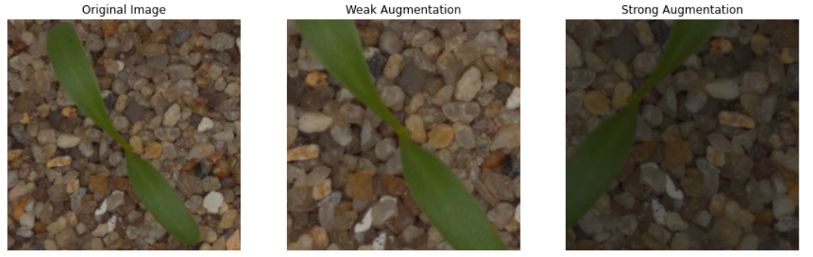
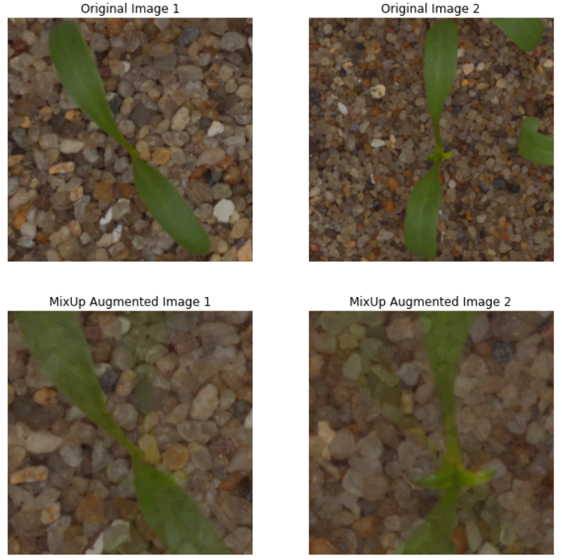

# 数据增广技术

在机器学习中，数据增强是一种常用的技术，它可以通过对原始数据进行一系列变换来生成新的训练数据，以增加数据的多样性和数量，从而提高模型的泛化能力和鲁棒性。其中，弱增强（weak augmentation）和强增强（strong augmentation）是两种不同的增强方式，而Mixup是一种数据增强技术。

弱增强通常是指对数据进行一些简单的变换，例如旋转、平移、缩放、翻转等，以增加数据的多样性，同时保留数据的基本特征。这种增强方式通常用于数据量较少的情况下，可以有效地减少过拟合的风险。

强增强则是指对数据进行更加复杂的变换，例如扭曲、剪切、变形、颜色变换等，以产生更多的变化和多样性。这种增强方式通常用于数据量较大的情况下，可以进一步提高模型的泛化能力和鲁棒性。

Mixup是一种数据增强技术，它通过将两个不同的样本进行线性插值来生成新的训练样本。具体来说，对于两个输入样本$x_1$和$x_2$，以及它们对应的标签$y_1$和$y_2$，mixup会生成一个新的样本$x_{new}$和标签$y_{new}$，其中$x_{new} = λ * x_1 + (1-λ) * x_2$，$y_{new} = λ * y1 + (1-λ) * y_2$，其中$λ$是一个在0和1之间的随机数。这种方法可以增加数据的多样性，同时减少过拟合的风险。

```python
import numpy as np
import torch
import torchvision.transforms as transforms
from PIL import Image
import matplotlib.pyplot as plt

# 加载图像
image_path = './example.png'
image = Image.open(image_path)


# 弱增强
weak_augmentation = transforms.Compose([
    transforms.RandomHorizontalFlip(),
    transforms.RandomCrop(300, padding=4),
    transforms.ToTensor()
#     transforms.Normalize((0.5, 0.5, 0.5), (0.5, 0.5, 0.5))
])

# 强增强
strong_augmentation = transforms.Compose([
    transforms.RandomHorizontalFlip(),
    transforms.RandomCrop(300, padding=4),
    transforms.RandomApply([transforms.ColorJitter(brightness=0.4, contrast=0.4, saturation=0.4, hue=0.1)], p=0.8),
    transforms.RandomGrayscale(p=0.2),
    transforms.ToTensor()
#     transforms.Normalize((0.5, 0.5, 0.5), (0.5, 0.5, 0.5))
])


# 应用弱增强
weak_augmented_image = weak_augmentation(image)

# 应用强增强
strong_augmented_image = strong_augmentation(image)


# 展示原始图像和增强后的图像
fig, axes = plt.subplots(1, 3, figsize=(15, 5))
axes[0].imshow(image)
axes[0].set_title('Original Image')
axes[1].imshow(transforms.ToPILImage()(weak_augmented_image))
axes[1].set_title('Weak Augmentation')
axes[2].imshow(transforms.ToPILImage()(strong_augmented_image))
axes[2].set_title('Strong Augmentation')


for ax in axes:
    ax.axis('off')

plt.show()
```

在上面的代码中，我们使用了torchvision中的一些常用的数据增强方法，如RandomRotation、RandomHorizontalFlip、ColorJitter、RandomResizedCrop等。以下是强增强和弱增强的结果：



```python
import numpy as np
import torch
import torchvision.transforms as transforms
from PIL import Image
import matplotlib.pyplot as plt

# 加载图像
image_path1 = './example.png'
image_path2 = './example2.png'
image1 = Image.open(image_path1)
image2 = Image.open(image_path2)

crop = transforms.Compose([
    transforms.CenterCrop(300),
    transforms.ToTensor(),
])
# MixUp增强
class MixUp:
    def __init__(self, alpha=1.0):
        self.alpha = alpha

    def __call__(self, images):
        images = [crop(image) for image in images]
        batch = torch.stack(images)
        batch_size = batch.size(0)
        indices = torch.randperm(batch_size)
        shuffled_data = batch[indices]
        
        lam = torch.Tensor([np.random.beta(self.alpha, self.alpha)]).expand(batch_size, 1, 1, 1)
        mixed_data = lam * batch + (1 - lam) * shuffled_data
        mixed_images = [transforms.ToPILImage()(mixed_data[i]) for i in range(batch_size)]
        return mixed_images

# 应用MixUp增强
mixup = MixUp(alpha=0.6)
mixup_augmented_images = mixup([image1, image2])

# 展示原始图像和增强后的图像
fig, axes = plt.subplots(2, 2, figsize=(10, 10))
axes[0, 0].imshow(image1)
axes[0, 0].set_title('Original Image 1')
axes[0, 1].imshow(image2)
axes[0, 1].set_title('Original Image 2')
axes[1, 0].imshow(mixup_augmented_images[0])
axes[1, 0].set_title('MixUp Augmented Image 1')
axes[1, 1].imshow(mixup_augmented_images[1])
axes[1, 1].set_title('MixUp Augmented Image 2')

for ax in axes.flatten():
    ax.axis('off')

plt.show()

```

我们创建了一个MixUp类，用于实现MixUp增强，使用'./example.jpg'和'./example2.jpg'图像共同组成一个batch，并进行MixUp增强，同时展示增强后的结果。以下是Mix up增强后的结果：



