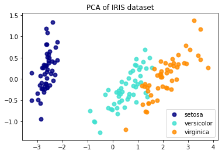

# PCA（主成分分析）& LDA（线性判别分析）


以下代码是一个简单的机器学习示例，用于展示如何对 Iris 数据集进行主成分分析（PCA）和线性判别分析（LDA）。

首先，代码导入了所需的库，包括 matplotlib、sklearn.datasets、sklearn.decomposition.PCA 和 sklearn.discriminant_analysis.LinearDiscriminantAnalysis。

```
import matplotlib.pyplot as plt
from sklearn import datasets
from sklearn.decomposition import PCA
from sklearn.discriminant_analysis import LinearDiscriminantAnalysis
```

接下来，代码加载了 Iris 数据集：

```
iris = datasets.load_iris()
```

Iris 数据集是一个经典数据集，包含三种不同种类的鸢尾花（setosa、versicolor 和 virginica），每种花有四个特征（萼片长度、萼片宽度、花瓣长度和花瓣宽度）。此代码将使用这些特征来训练 PCA 和 LDA 模型，以将鸢尾花样本在二维空间中可视化。

接下来，代码将数据集中的特征和标签分别存储在 X 和 y 变量中：

```
X = iris.data
y = iris.target
```

变量 target_names 存储了三种不同种类的鸢尾花的名称：

```
target_names = iris.target_names
```

接下来，代码使用 PCA 模型将 Iris 数据集投影到二维空间中：

```
pca = PCA(n_components=2)
X_r = pca.fit(X).transform(X)
```

这里将 n_components 设置为 2，表示将 Iris 数据集投影到二维空间中。PCA 模型将自动选择最具代表性的两个主成分来进行投影，并且 fit 方法将使用原始数据 X 训练 PCA 模型。

接下来，代码使用 LDA 模型将 Iris 数据集投影到二维空间中：

```
lda = LinearDiscriminantAnalysis(n_components=2)
X_r2 = lda.fit(X, y).transform(X)
```

类似地，这里将 n_components 设置为 2，表示将 Iris 数据集投影到二维空间中。LDA 模型将使用标签 y 来训练，并使用 fit 方法来训练 LDA 模型。

最后，代码将投影后的数据用散点图可视化。在 PCA 和 LDA 可视化中，不同颜色的点表示不同种类的鸢尾花。图例中的标签为 target_names 中的鸢尾花名称。代码使用 matplotlib 库的 scatter 函数绘制散点图。

```
plt.figure()
colors = ['navy', 'turquoise', 'darkorange']
lw = 2

for color, i, target_name in zip(colors, [0, 1, 2], target_names):
    plt.scatter(X_r[y == i, 0], X_r[y == i, 1], color=color, alpha=.8, lw=lw,
                label=target_name)
plt.legend(loc='best', shadow=False, scatterpoints=1)
plt.title('PCA of IRIS dataset')

plt.figure()
for color, i, target_name in zip(colors, [0, 1, 2], target_names):
    plt.scatter(X_r2[y == i, 0], X_r2[y == i, 1], alpha=.8, color=color,
                label=target_name)
plt.legend(loc='best', shadow=False, scatterpoints=1)
plt.title('LDA of IRIS dataset')

plt.show()
```

要将代码中使用的数据替换为自己的数据，您需要创建一个 Numpy 数组来存储您的数据。将数据存储在 X 变量中，确保每个样本都是一行，并且每个特征都是一列。然后，按照相同的方式运行 PCA 和 LDA。最后，使用 scatter 函数将投影后的数据用散点图可视化。




---

# Autoencoder（自编码器）


这段代码是一个使用PyTorch实现的简单的自编码器（Autoencoder）模型，用于对图像进行压缩编码和解码的任务。以下是代码的详细解释：

1. 导入所需的库：

```
import torch
import torch.nn as nn
import torch.optim as optim
import torchvision.transforms as transforms
from torchvision.datasets import ImageFolder
import matplotlib.pyplot as plt
```

这段代码导入了PyTorch及其相关的库，包括用于构建神经网络的`torch.nn`模块，用于优化模型的`torch.optim`模块，用于图像数据处理的`torchvision.transforms`模块，用于加载图像数据集的`torchvision.datasets.ImageFolder`模块，以及用于绘制图像的`matplotlib.pyplot`模块。

2. 定义数据预处理操作：

```
transform = transforms.Compose([
    transforms.Resize(64),
    transforms.CenterCrop(64),
    transforms.ToTensor()
])
```

这段代码定义了一系列的数据预处理操作，包括将图像调整为大小为64x64像素，居中裁剪为64x64像素，并将图像转换为张量（Tensor）形式。

3. 加载数据集：

```
data_dir = "./data"
dataset = ImageFolder(data_dir, transform=transform)
```

这段代码通过`torchvision.datasets.ImageFolder`模块加载了位于`./data`目录下的图像数据集，并应用了之前定义的数据预处理操作。

4. 创建数据加载器：

```
batch_size = 32
data_loader = torch.utils.data.DataLoader(dataset, batch_size=batch_size, shuffle=True)
```

这段代码使用`torch.utils.data.DataLoader`模块创建了一个用于批量加载数据的数据加载器（DataLoader），每批次包含32张图像，并且在每次迭代时对数据进行了随机洗牌（shuffle=True）。

5. 定义自编码器模型：

```
class Autoencoder(nn.Module):
    def __init__(self):
        super(Autoencoder, self).__init__()
        self.encoder = nn.Sequential(
            nn.Conv2d(3, 16, kernel_size=3, stride=2, padding=1),
            nn.ReLU(),
            nn.Conv2d(16, 8, kernel_size=3, stride=2, padding=1),
            nn.ReLU(),
            nn.Conv2d(8, 4, kernel_size=3, stride=2, padding=1),
            nn.ReLU()
        )
        self.decoder = nn.Sequential(
            nn.ConvTranspose2d(4, 8, kernel_size=3, stride=2, padding=2),
            nn.ReLU(),
            nn.ConvTranspose2d(8, 16, kernel_size=5, stride=3, padding=3),
            nn.ReLU(),
            nn.ConvTranspose2d(16, 3, kernel_size=2, stride=2, padding=3),
            nn.Sigmoid()
        )

    def forward(self, x):
        x = self.encoder(x)
        x = self.decoder(x)
        return x
```

这段代码定义了自编码器模型的结构，包括了一个编码器（encoder）和一个解码器（decoder）。编码器负责将输入的图像数据压缩成较低维度的特征表示，而解码器负责将这些特征表示恢复成与输入图像相似的图像。

6. 定义损失函数和优化器：

```
autoencoder = Autoencoder()
criterion = nn.MSELoss()
optimizer = optim.Adam(autoencoder.parameters(), lr=0.001)
```

7. 训练自编码器：

```
num_epochs = 50
for epoch in range(num_epochs):
    for data in data_loader:
        images, _ = data
        optimizer.zero_grad()
        outputs = autoencoder(images)
        loss = criterion(outputs, images)
        loss.backward()
        optimizer.step()
    print('Epoch [{}/{}], Loss: {:.4f}'.format(epoch+1, num_epochs, loss.item()))
```

这段代码进行了自编码器的训练。通过迭代遍历数据加载器中的图像数据，将图像输入自编码器得到输出，计算输出与原始输入图像的损失，并根据损失值使用反向传播（backward）和优化器（optimizer.step()）更新自编码器的参数。训练过程中会打印每个epoch的损失值。

8. 使用训练好的自编码器进行图像重建：

```
torch.no_grad():
    for data in data_loader:
        images, _ = data
        outputs = autoencoder(images)
        # 可视化原始图像和重建图像
        plt.imshow(images[0].permute(1, 2, 0))
        plt.show()
        plt.imshow(outputs[0].permute(1, 2, 0))
        plt.show()
```

这段代码使用训练好的自编码器对加载的图像数据进行重建，并通过matplotlib库将原始图像和重建图像进行可视化展示。


以上就是这段代码的主要内容，它实现了一个简单的自编码器模型，并通过无监督学习的方式对图像数据进行了压缩和重建。

